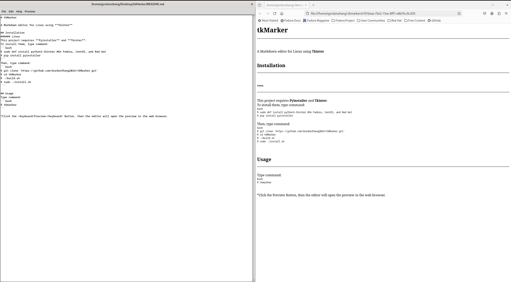

# tkMarker

A Markdown editor using **Tkinter**



## Installation
###### Linux
This project requires **Pyinstaller** and **Tkinter**.
To install them, type command:
```bash
$ sudo dnf install python3-tkinter #On Fedora, CentOS, and Red Hat
$ pip install pyinstaller
```
Then, type command:
```bash
$ git clone 'https://github.com/GordonZhang2024/tkMarker.git'
$ cd tkMarker
$ ./build.sh
$ sudo ./install.sh
```

## Usage
Type command:
```bash
$ tkmarker
```
You will see the editor.

*Click the <keyboard>Preview</keyboard> Button, then the editor will open the preview in the web browser.

